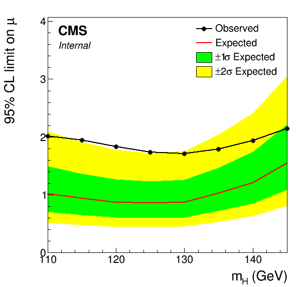

Limits {#limits}
================

[TOC]

In these examples we will work through several different limit calculations using datacards from the Run 1 HTT analyses.

# Limits in models with one POI {#limits-one-POI}

First we will compute limits vs mH in the legacy SM Higgs analysis (HIG-13-004). This task will be broken down into several steps:
 
 1. Creating the datacards and shape files using CombineHarvester
 2. Combining datacards per-channel and converting to binary workspaces
 3. Running the asymptotic limit calculation for each signal mass point
 4. Collecting the combine output into a common json format
 5. Using these json files to create plots of the limits

## Creating the datacards {#limits-creating-the-datacards}
Go to the `CombineTools` directory and create the datacards using the `SMLegacyExample.py` script:

    cd $CMSSW_BASE/src/CombineHarvester/CombineTools
    python scripts/SMLegacyExample.py

This will create a familiar structure of datacards in `output/sm_cards`, with one subdirectory containing the datacards for all channels and categories (`cmb`) and subdirectories containing just the cards for specific channels (e.g. `tt`). Within each of these directories the cards are organised into further subdirectories corresponding to the mass of the signal.

## Building the workspaces {#limits-building-the-workspaces}
We will focus on computing the limits for each channel separately, but before we get to this we need to turn the datacards into binary RooFit workspaces. This means combining the cards from each category into a single text datacard with `combineCards.py`, then running `text2workspace.py` to convert this single card into a workspace.

\note It is possible to run `combine` directly with a text datacard as input. Internally `combine` will just run `text2workspace.py` on it first with some default options and save the resulting workspace in a temporary location. For anything other than very simple models it is preferable to create the workspaces manually which can then be reused for later calculations.

The `combineTool.py` script has a mode called **T2W** that passes options through to `text2workspace.py` and supports multiple datacard or directory options. With a directory argument, all the cards within that directory are combined first. If the enclosing directory is a number then this will automatically be used as the `-m [mass]` option in `text2workspace.py`, so there is no need to specify this explicitly. We can also take advantage of the `--parallel` option to build multiple workspaces simultaneously.

    cd output/sm_cards
    combineTool.py -M T2W -i {ee,mm,em,et,mt,tt}/* -o workspace.root --parallel 4

Here we have specified the name of the output workspace explicitly with the  `-o` option. The **T2W** mode also has a `--cc` option that can be used to specify the name of the combined text datacard that is created (default is `combined.txt`). When individual datacards are given as input, this option causes the cards to be combined first and produces a single workspace, as opposed to the default behaviour which would create a workspace per datacard. Run `combineTool.py -M T2W -h` for more information.

## Calculating limits {#limits-calculating-limits}

We now have a set of workspaces within a `{channel}/{mass}/workspace.root` directory structure. The next step is simply to run the **Asymptotic** mode of combine on each workspace, which again can be done with `combineTool.py`. The normal `-d/--datacard` option is enhanced to support multiple workspaces: 

    combineTool.py -M Asymptotic -d */*/workspace.root --there -n .limit --parallel 4

One minor complication is that `combine` produces its output in the directory we run it from. In this case the outputs for a mass point in the different channels will overwrite each other as there is nothing in the name option (`-n`) to distinguish them. The solution is to add the `--there` option which will run each `combine` command in the directory where the workspace is located.

## Collect the output {#limits-collecting}

Each output file contains a "limits" TTree with one entry for each of the observed and expected limits, for example:
 
    *********************************************************************************
    *    Row   *                   mh *     quantileExpected *                limit *
    *********************************************************************************
    *        0 *                  125 *                0.025 *              0.43943 *
    *        1 *                  125 *                0.160 *              0.59707 *
    *        2 *                  125 *                0.500 *              0.85547 *
    *        3 *                  125 *                0.840 *                1.234 *
    *        4 *                  125 *                0.975 *                 1.72 *
    *        5 *                  125 *               -1.000 *               1.7361 *
    *********************************************************************************


This could be used as a direct input for plotting but here we will use another `combineTool.py` method, **CollectLimits** to covert the information in these files to a more easily readable json file. This is a useful intermediate format for producing different figures and tables as it is simple to parse as a dictionary object in python. 

We can use the directory structure to collect all the outputs in one go, creating one json file per channel:

    combineTool.py -M CollectLimits */*/*.limit.* --use-dirs -o limits.json

By default the **CollectLimits** method will assume all the limit results should be merged into a single json file, but with the `--use-dirs` option it will group the output files according the parent directory name (skipping directories that correspond to mass values). The output files will have these directory names appended, e.g. `limits_mt.json`. The files are structured like a dictionary with one entry per mass value, e.g.

~~~py
{
  "110.0": {
    "exp+1": 1.4916164875030518,
    "exp+2": 2.1045162677764893,
    "exp-1": 0.7012145519256592,
    "exp-2": 0.5117874145507812,
    "exp0": 1.01171875,
    "obs": 2.010412310353403
  },
  "115.0": {
    "exp+1": 1.3615484237670898,
    "exp+2": 1.9097926616668701,
    "exp-1": 0.6493316888809204,
    "exp-2": 0.47591400146484375,
    "exp0": 0.93359375,
    "obs": 1.9418526167603543
  },
  ...
}
~~~

\note **CollectLimits** currently only supports the output the of the **Asymptotic** limit calculation. In future it will be extended to support extracting the results of  toy-based signal injected limits as well as full CLs in the **HybridNew** method.

## Plotting {#limits-plotting}

The CombineHarvester `plotting` module provides a number of functions that can save time when creating limit plots. In particular, there are functions to convert a json file into a set of TGraphs containing the observed and expected limits as well as the 68 and 95% expected intervals. A minimal example is given below:

```py
import ROOT
from CombineHarvester.CombineTools.plotting import *
ROOT.PyConfig.IgnoreCommandLineOptions = True
ROOT.gROOT.SetBatch(ROOT.kTRUE)

# Style and pads
ModTDRStyle()
canv = ROOT.TCanvas('limit', 'limit')
pads = OnePad()

# Get limit TGraphs as a dictionary
graphs = StandardLimitsFromJSONFile('limits_mt.json')

# Create an empty TH1 from the first TGraph to serve as the pad axis and frame
axis = CreateAxisHist(graphs.values()[0])
axis.GetXaxis().SetTitle('m_{H} (GeV)')
axis.GetYaxis().SetTitle('95% CL limit on #mu')
pads[0].cd()
axis.Draw('axis')

# Create a legend in the top left
legend = PositionedLegend(0.3, 0.2, 3, 0.015)

# Set the standard green and yellow colors and draw
StyleLimitBand(graphs)
DrawLimitBand(pads[0], graphs, legend=legend)
legend.Draw()

# Re-draw the frame and tick marks
pads[0].RedrawAxis()
pads[0].GetFrame().Draw()

# Adjust the y-axis range such that the maximum graph value sits 25% below
# the top of the frame. Fix the minimum to zero.
FixBothRanges(pads[0], 0, 0, GetPadYMax(pads[0]), 0.25)

# Standard CMS logo
DrawCMSLogo(pads[0], 'CMS', 'Internal', 11, 0.045, 0.035, 1.2, '', 0.8)

canv.Print('.pdf')
canv.Print('.png')
```

This will produce a standard limit plot:



A more fully-featured example can be found in `CombineTools/scripts/plotLimits.py`. This script support multiple json file arguments for drawing combined observed/expected bands as above, or specifying single limits to draw. For the former it is enough to just give the json file as the argument. It is possible to restrict the output to just the observed or expected limits with the `--show obs` or `--show exp` option. With the latter it's possible to overlay limits from different json files:

    plotLimits.py limits_{ee,em,et,mm,mt,tt}.json:obs --auto-style

The limit to draw from each file is specified as `[file.json]:[limit]`. The `--auto-style` option will draw each TGraph with a different colour. Each TGraph can be styled further by extending the input argument: `[file.json]:[limit]:[style options]`. The last part is a comma-separated list of style settings that will be applied to the TGraph. All single-argument `SetXYZ(...)` methods are supported, e.g. `'limits_mt.json:exp:Title="#mu#tau_{h}",LineStyle=4` is equivalent to doing:

```cpp
graph.SetTitle("#mu#tau_{h}")
graph.SetLineStyle(4)
```

The following command will draw the observed and expected limits for three of the channels:

    plotLimits.py --auto-style obs,exp \
      'limits_mt.json:obs:Title="#mu#tau_{h} Observed"'       \
      'limits_mt.json:exp0:Title="#mu#tau_{h} Expected"'      \
      'limits_et.json:obs:Title="e#tau_{h} Observed"'         \
      'limits_et.json:exp0:Title="e#tau_{h} Expected"'        \
      'limits_tt.json:obs:Title="#tau_{h}#tau_{h} Observed"'  \
      'limits_tt.json:exp0:Title="#tau_{h}#tau_{h} Expected"'

Note the use of single quotes to prevent bash removing the double quotes surrounding the graph titles. Here the `--auto-style` argument is given a list of groups for assigning style options. Graphs in each group are given a common line style and the same pool of colours are assigned in order for graphs within that group. The output of this command is given below.


## Workflow with RooMorphingPdf datacards {#limits-morphing-cards}

For datacards using RooMorphingPdfs for the signal, the steps to produce limits are similar to the per-mass case above, with the main difference being the need to specify the set of mass values explicitly rather than picking this up from the directory structure. The `SMLegacyMorphing` program will create similar directory structure with the RooMorphingPdf version of the HIG-13-004 cards:

    cd $CMSSW_BASE/src/CombineHarvester/CombineTools
    SMLegacyMorphing

This program creates a directory per channel which already contain a combined datacard. We can specify these cards directly in the text2workspace step.

    cd output/sm_cards_morphed/
    combineTool.py -M T2W -i {ee,mm,em,et,mt,tt}/combinedCard.txt -o workspace.root --parallel 4

For the **Asymptotic** calculation we take advantage of the enhanced `-m` option to compute the limit in 2 GeV steps:

    combineTool.py -M Asymptotic -d */workspace.root -m 110:144:2 --freezeNuisances MH --there -n .limit --parallel 4

After this, the output collection and the plotting is the same as above:

    combineTool.py -M CollectLimits */*.limit.* --use-dirs -o limits.json
    plotLimits.py limits_mt.json


# Limit as a function of some other variable

*coming soon*

# Limits in models with more than one POI {#limits-more-POIs}

## Expected limits: pre-fit vs post-fit {#limits-pre-vs-post}

With the *Asymptotic* method of combine it is only possible to determine a limit for a single POI at a time. This POI will be chosen as the first one in the list of POIs embedded within the workspace. Therefore it is best to always specify the POI list explicitly, putting the one you want the limit for first in the list, e.g.

    combine -M Asymptotic -d workspace.root -m 125 --redefineSignalPOIs r_ggH,r_qqH
    

to set a limit on `r_ggH`. You should also decide how to treat the other POIs in the fits for the limit extraction. By default combine will allow all other POIs to float freely, so in this example `r_qqH` will be profiled. If instead you wish to fix it to a particular value then it should not be included in the list of POIs, e.g.

    combine -M Asymptotic -d workspace.root -m 125 --redefineSignalPOIs r_ggH --setPhysicsModelParameters r_qqH=0.0 --freezeNuisances r_qqH

There is a further issue to consider when computing expected limits without a fit to the data (combine option `--run blind` or when generating toy datasets with `-t`). For the profiled case combine must generate a background-only pre-fit asimov dataset for use in the asymptotic calculation. In doing this only the first POI in the list will be fixed to zero. So if the other POI values are non-zero then the asimov dataset will contain a (probably) unwanted signal contribution. To avoid this it is safest to explicitly set the values of the other POIs to zero, e.g.

    combine -M Asymptotic -d workspace.root -m 125 --redefineSignalPOIs r_ggH,r_qqH --setPhysicsModelParameters r_qqH=0.0

## Signal injected limits

*coming soon*

@xmlonly
Here we outline a procedure for generating toy datasets at a chosen mass hypothesis and determining the expected limit at other mass hypotheses. This example assumes you have a single workspace in which `MH` is a free parameter.

Postfit:

combine -M MultiDimFit -t -1 --toysFrequentist --redefineSignalPOIs r -m 125 --setPhysicsModelParameters r=1 --expectSignal 1 -v 3 -d htt_mt.root --cminDefaultMinimizerType Minuit2 --saveWorkspace -n .postfit

Dealing with multiple POIs:

Injected SM125 into MSSM:
 - generate with x=1

combine -M GenerateOnly --saveToys -t 10 -d higgsCombine.postfit.MultiDimFit.mH125.root -m 125 -n .postfit.toys --expectSignal 1 --snapshotName MultiDimFit


    combineTool.py -M Asymptotic -t 10 --toysFile higgsCombine.postfit.toys.GenerateOnly.mH125.'%(SEED)s'.root -s 1,2,3 -m 110:145:5 -d higgsCombine.postfit.MultiDimFit.mH125.root --expectSignal 1 --snapshotName MultiDimFit --setPhysicsModelParameters MH='%(MASS)s' --run observed --dry-run
@endxmlonly


